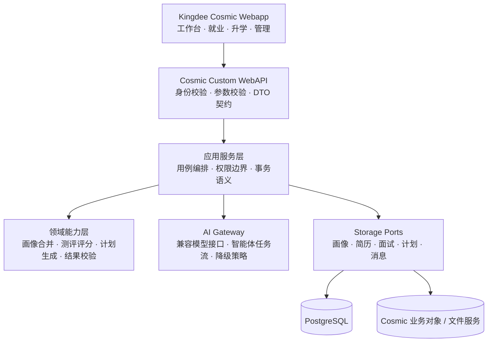
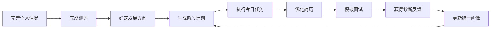

<div align="center">

# CyanCruise · 青途启航

**基于金蝶云苍穹（Kingdee Cosmic）的 AI 职业发展与升学规划平台**

<br>

让画像、目标、行动与反馈形成持续进化的个人成长闭环

<br>

[](#金蝶云苍穹平台能力)
[](#技术栈)
[](#快速开始)
[](#技术栈)
[](#工程设计)
[](LICENSE)

</div>

---

## 项目概述

CyanCruise 是构建于<strong>金蝶云苍穹(Kingdee Cosmic)</strong>之上的大学生成长与生涯决策智能平台。项目以苍穹企业级应用能力作为运行底座，以个人画像为数据中枢，将职业测评、简历优化、行动计划、模拟面试、求职辅助与升学规划连接为完整业务链路。

平台通过金蝶云苍穹的登录身份、业务对象、附件服务、Custom WebAPI 与应用菜单承载真实业务流程。CyanCruise 不只回答“我适合什么”，更关注“下一步具体做什么”：持续吸收测评结果、简历状态、面试反馈与阶段目标，动态生成可执行任务，并通过 AI 分析与规则引擎帮助用户完成从认识自己到实现目标的全过程。

```text
认识自己 → 明确方向 → 制定路径 → 每日行动 → 实践反馈 → 动态调整
   ↑                                                      │
   └──────────────── 统一成长画像持续更新 ────────────────┘
```

## 核心亮点

- **双路径成长体系**：同时覆盖就业与升学场景，就业、考研、保研、留学可独立规划，也能共享个人画像与成长资料。
- **统一画像中枢**：将基本情况、职业偏好、测评、简历、面试和计划拆分为独立数据块，局部更新不覆盖其他成长信息。
- **AI 与规则协同**：AI 负责理解、分析与生成，规则服务负责评分、校验、摘要与降级，在模型不可用时仍保留基础业务能力。
- **可替换基础设施**：AI Provider、业务存储、登录身份、文件服务均通过接口隔离，可按运行环境切换实现。
- **全过程数据闭环**：计划可拆解到每日任务，测评、简历诊断和面试结果会反向更新画像与后续建议。
- **金蝶平台融合**：接入苍穹登录上下文、业务对象、附件服务、Custom WebAPI 和平台菜单，形成可部署的企业级应用能力。
- **规格驱动研发**：使用 OpenSpec 管理需求、设计、任务与验收场景，让业务变更具备可追踪的工程依据。

## 功能全景

| 领域 | 能力 |
| --- | --- |
| **成长工作台** | 汇总目标方向、画像完整度、准备状态、今日重点与快捷入口 |
| **个人画像** | 采集教育背景、目标岗位、发展意向、经历与偏好，支持 AI 深度分析和历史记录 |
| **职业测评** | 支持 MBTI、职业兴趣、大五人格、职业价值观、压力应对等量表，提供题库抽题、服务端评分与结果解读 |
| **简历中心** | 简历档案、文件上传与预览、PDF 文本提取、关键词识别、诊断评分及优化建议 |
| **行动与计划** | 生成阶段里程碑、本周重点和每日任务，支持任务状态维护与准备度联动 |
| **模拟面试** | AI 文字面试、逐题追问、记录回看、综合评分与复盘报告；提供带本地音视频预览的全景练习模式 |
| **智能助手** | 基于用户画像与业务上下文进行连续对话，支持会话管理、结构化输出与工具调用 |
| **就业服务** | 就业洞察、职业资源、岗位方向辅助与消息通知 |
| **升学中心** | 考研、保研、留学方向选择，阶段路线、院校目标、备考任务、申请材料与规划资料管理 |
| **管理控制台** | 测评题库、内容资源、通知广播、用户状态、审计日志与平台配置治理 |

## 金蝶云苍穹平台能力

CyanCruise 以金蝶云苍穹作为统一的应用运行与集成平台，业务能力通过清晰的适配边界与苍穹服务协同：

| 平台能力 | CyanCruise 集成方式 |
| --- | --- |
| **统一身份** | 从苍穹登录上下文解析用户、组织与角色，隔离普通用户和管理员权限 |
| **Custom WebAPI** | 将画像、测评、简历、面试、规划、升学和管理能力发布为稳定的平台接口 |
| **业务对象** | 通过 Cosmic Datamodel Gateway 读写画像、简历、任务、面试和计划等业务数据 |
| **附件服务** | 对接苍穹 BOS 附件能力，支持简历及规划资料的上传、预览、下载与文本提取 |
| **应用菜单** | 使用平台外部链接菜单挂载首页、就业中心、升学中心、面试和管理后台等页面 |
| **应用交付** | 通过 Gradle 任务构建业务 JAR、部署 Webapp，并同步到配置的 Cosmic 运行目录 |

平台相关实现集中在 `cloud01-app01` 的身份、数据模型、文件与 WebAPI 适配层；领域规则保持独立，从而兼顾苍穹环境集成和自动化测试。

## 技术栈

| 层级 | 技术与设计 |
| --- | --- |
| **核心语言** | Java 8，面向接口的领域服务与应用服务设计 |
| **构建体系** | Gradle Wrapper，多模块工程，统一编译、测试、打包与部署任务 |
| **平台接口** | Kingdee Cosmic Custom WebAPI、登录上下文、业务对象与附件服务适配 |
| **数据存储** | PostgreSQL JDBC、Cosmic 业务对象存储、内存测试实现 |
| **AI 基础设施** | OpenAI Compatible API、可插拔 Provider、流式事件、结构化响应、工具调用与安全降级 |
| **智能体集成** | 智能体任务流接口、场景适配器、上下文组装与结果校验 |
| **文档处理** | Apache PDFBox，用于 PDF 简历文本提取 |
| **数据序列化** | Jackson Databind + Java Time Module |
| **Web 应用** | 原生 HTML / CSS / JavaScript，模块化页面、路由、服务与组件；MediaDevices / Web Speech API 渐进增强 |
| **质量保障** | JUnit 5、Web 路由契约校验、JavaScript 语法检查、OpenSpec 严格校验 |

## 系统架构



### 分层职责

| 模块 | 职责 |
| --- | --- |
| `base-common` | DTO、常量、跨模块接口与稳定业务契约 |
| `base-helper` | 不依赖运行环境的评分、合并、摘要、校验与 AI 报文辅助能力 |
| `cloud01-app01` | 应用服务、WebAPI、AI / 存储 / 身份 / 文件适配器及运行时装配 |
| `webapp` | 用户工作台、就业与升学页面、管理控制台及平台展示资源 |
| `datamodel` | 业务对象映射、PostgreSQL 数据结构与建模说明 |
| `openspec` | 业务规格、架构决策、变更设计、实现任务与验收场景 |

## 核心业务闭环



画像是整个闭环的共享上下文。每项能力只更新自己负责的数据块，应用层再根据目标岗位、准备状态与最新反馈计算下一步行动，避免各功能成为彼此割裂的工具集合。

## 工程设计

### 1. 端口与适配器

核心业务只依赖 `Storage`、`AiGateway`、身份上下文和文件服务等抽象契约。PostgreSQL、Cosmic 业务对象、兼容模型接口及本地测试实现作为适配器装配，使领域规则可以独立测试，也便于不同部署环境复用。

### 2. AI 场景化编排

平台在统一 AI 网关之上按场景提供适配器，覆盖画像分析、职业计划、简历诊断、模拟面试、学习规划和助手会话。模型输出进入业务前必须完成结构解析、字段校验与边界修正；模型不可用时返回明确状态或启用基础规则结果。

### 3. 数据归属与权限边界

所有用户数据操作均以可信登录上下文为入口，并在画像、简历、诊断、面试、计划和资料等边界执行所有权校验。管理能力与普通用户能力分离，敏感配置不通过前端回显。

### 4. 规格与实现同步

重要能力以 `proposal → spec → design → tasks → implementation → verification` 推进。OpenSpec 场景既描述产品行为，也作为实现与测试的验收依据，确保代码、文档和业务语义保持一致。

## 项目结构

```text
CyanCruise/
├── code/
│   ├── base/
│   │   ├── v620-cc001-base-common/       # 公共 DTO、常量与契约
│   │   └── v620-cc001-base-helper/       # 领域规则与通用辅助能力
│   ├── cloud01/
│   │   └── v620-cc001-cloud01-app01/     # 应用服务、WebAPI 与基础设施适配
│   └── v620-cosmic-debug/                # 本地调试入口
├── datamodel/                            # 数据模型、字段映射与 SQL
├── webapp/isv/v620/cyancruise/           # Web 页面、路由、组件与设计样式
├── openspec/
│   ├── specs/                            # 已生效的系统规格
│   └── changes/                          # 进行中与已归档的变更
├── docs/                                 # 部署、接口、建模与业务说明
├── gradle/                               # Gradle Wrapper 运行文件
├── build.gradle                          # 根构建与部署任务
├── settings.gradle                       # 多模块配置
└── README.md
```

## 快速开始

### 环境要求

| 工具 | 要求 |
| --- | --- |
| JDK | 1.8 |
| 构建工具 | 仓库内置 `gradlew.bat` |
| 运行平台 | Kingdee Cosmic 开发 / 运行环境 |
| 数据库 | PostgreSQL（共享运行与持久化场景） |
| Node.js | 可选，用于 Web 资源静态检查 |
| OpenSpec CLI | 可选，用于规格严格校验 |

### 1. 初始化本地配置

```powershell
Copy-Item gradle.properties.example gradle.properties
Copy-Item debug-local.properties.example debug-local.properties
```

按本机环境填写 `gradle.properties` 中的 Cosmic 路径。运行地址、数据库、AI Provider 和身份适配等参数通过配置或环境变量注入，请勿将本机路径、租户信息、访问令牌或 API Key 提交到仓库。

### 2. 构建项目

```powershell
$env:JAVA_HOME = 'F:\kingdee\ENV\jdk'
$env:Path = "$env:JAVA_HOME\bin;$env:Path"
.\gradlew.bat clean build
```

### 3. 部署资源

```powershell
# 打包并复制业务模块 JAR
.\gradlew.bat deployJar

# 部署 CyanCruise Web 资源
.\gradlew.bat deployWebapp
```

具体运行参数、数据库初始化和平台挂载方式请参考 [`docs/cyancruise-runtime-deploy.md`](docs/cyancruise-runtime-deploy.md) 与 [`docs/cyancruise-cosmic-platform-mounting.md`](docs/cyancruise-cosmic-platform-mounting.md)。

## 验证

```powershell
# Java 编译与测试
.\gradlew.bat clean build

# Web 路由、页面契约与脚本语法
node webapp\isv\v620\cyancruise\validate-routes.js
node --check webapp\isv\v620\cyancruise\assets\app.js

# 全量规格校验
openspec validate --all --strict
```

## 设计原则

- **用户目标优先**：所有功能最终落到清晰、可执行的下一步行动。
- **数据只保存一次**：画像作为统一上下文，减少重复填写与信息割裂。
- **AI 可用但不失控**：结构化契约、结果校验、权限校验与降级策略共同约束模型能力。
- **平台能力可替换**：业务规则不绑定具体数据库、模型供应商或文件实现。
- **面向真实运行**：兼顾共享存储、可信身份、审计治理、失败恢复和渐进增强。
- **中文表达清晰**：页面与提示使用普通用户能理解的语言，避免专业缩写成为使用门槛。

## 项目状态

CyanCruise 正在持续完善就业与升学双路径能力。职业画像、测评、简历、诊断、行动计划、模拟面试、智能助手、就业资源、升学规划和管理治理已形成模块化实现；具体环境中的模型、数据库、身份、文件与平台菜单需按部署文档完成配置。

## License

本项目基于 [MIT License](LICENSE) 开放使用。

---

<div align="center">

**CyanCruise · 让每一次选择，都通向更清晰的未来**

</div>
